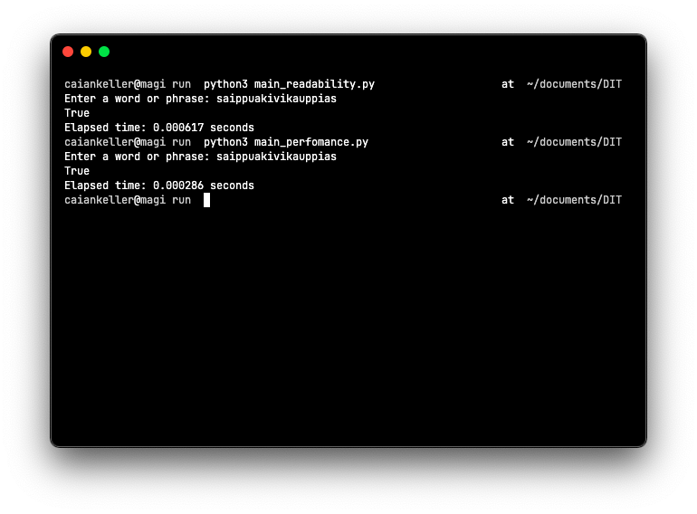

# Digital Interactions Test



## Instructions

> use Python3

### How to run

Perfomance focused 
```
    python3 main_perfomance.py
```

Readability focused
```
    python3 main_readability.py
```

###  How to run tests

Perfomance focused 
```
    python3 main_perfomance_test.py
```

Readability focused
```
    python3 main_readability_test.py
```